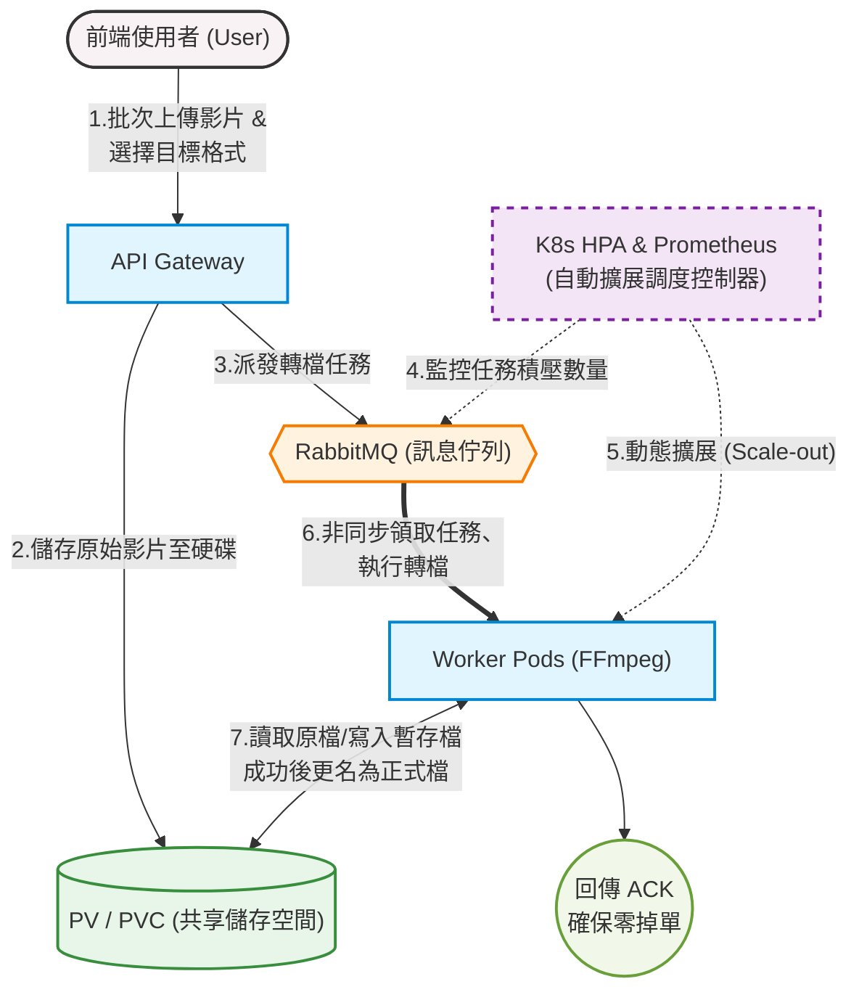

# 基於 Kubernetes 的自動擴展影音轉檔系統
> **Kubernetes-based Auto-scaling Video Transcoding System** 


本專題針對傳統單機影音轉檔系統在面對高併發流量時容易造成的效能瓶頸，引入雲端原生 **Kubernetes (K8s)** 容器編排技術，結合 **RabbitMQ** 任務佇列與 **Prometheus** 指標監控，打造出能依據待處理任務積壓量進行 **HPA (Horizontal Pod Autoscaler)** 動態水平擴展的影音轉檔平台。

---

## 💡 核心特色 (Features)

* **雲端原生彈性擴展**：透過 Prometheus 監控 RabbitMQ 佇列積壓量，由 K8s HPA 自動控制 Worker Pod 的 Scale-out / Scale-in。
* **非同步解耦與高容錯**：網頁接收與影音轉檔完全解耦，搭配 RabbitMQ ACK 確認機制，確保任務零遺失。
* **暫存更名機制 (Temp File Rename)**：Worker 轉檔過程中輸出 `.tmp` 暫存檔，完成後始切換為正式副檔名，防堵使用者下載到損壞或未完成的半成品影片。
* **資源優化與多格式支援**：前端支援 MP4/MOV/AVI 批次上傳與目標格式選擇，後端 Worker 強制限制 720p 與最大 2 執行緒，防止硬體資源耗盡。

---

## 🏗️ 系統架構圖 (Architecture)



---

## 🛠️ 技術堆疊 (Tech Stack)

| 類別 | 技術 / 工具 | 說明 |
| :--- | :--- | :--- |
| **基礎設施 (Infra)** | Kubernetes, Docker, Minikube | 微服務容器編排與本地叢集模擬 (WSL2) |
| **前後端 (Full-stack)** | Python 3.10, FastAPI, Tailwind CSS | 高併發非同步 API 閘道器與現代化 Web 介面 |
| **轉檔與佇列 (Core)** | FFmpeg, RabbitMQ | 影音處理引擎與任務訊息代理 (Message Broker) |
| **監控與擴展 (Autoscale)**| Prometheus, K8s HPA | 時序資料庫監控與 Pod 自動水平擴展 |

---

## 📁 目錄結構 (Directory Structure)

```text
.
├── app/            
│   ├── api.py
│   ├── worker.py
│   └── requirements.txt
├── k8s/                    
│   ├── core/
│   │     ├──api.yaml
│   │     ├──rabbitmq.yaml
│   │     ├──storage.yaml
│   │     └──worker.yaml
│   └── monitoring/      
│         ├──adapter-config.yaml
│         ├──adapter-config-map.yaml
│         ├──prometheus.yaml
│         ├──prometheus-adapter.yaml
│         └──prometheus-config.yaml
├── Dockerfile
├── Dockerfile.api
└── README.md
```

---

## 💻 環境建置與安裝 (Installation & Prerequisites)

### 1. clone專案
### 2. 基礎環境準備

在開始之前，請確保您的系統（建議使用 **Windows 11 + WSL2** 或 **Ubuntu Linux**）已安裝以下工具：

1. **WSL2 (Windows Subsystem for Linux)**
   ```bash
   wsl --install
   ```
2. **Docker Desktop**
   * 下載並安裝 [Docker Desktop](https://www.docker.com/products/docker-desktop/)。
   * 在 Settings > Resources > WSL Integration 中勾選啟用的 WSL2 發行版。
3. **Minikube & kubectl**
   ```bash
   # 安裝 kubectl
   curl -LO "[https://dl.k8s.io/release/$(curl](https://dl.k8s.io/release/$(curl) -sL [https://dl.k8s.io/release/stable.txt)/bin/linux/amd64/kubectl](https://dl.k8s.io/release/stable.txt)/bin/linux/amd64/kubectl)"
   sudo install -o root -g root -m 0755 kubectl /usr/local/bin/kubectl

   # 安裝 Minikube
   curl -LO [https://storage.googleapis.com/minikube/releases/latest/minikube-linux-amd64](https://storage.googleapis.com/minikube/releases/latest/minikube-linux-amd64)
   sudo install minikube-linux-amd64 /usr/local/bin/minikube
   ```

---

### 3. 啟動 Minikube 叢集

啟動 Minikube 並啟用所需的套件（Metrics Server 與 Ingress）：

```bash
# 啟動 Minikube 叢集
minikube start --driver=docker --cpus=4 --memory=8192

# 啟用外掛套件
minikube addons enable metrics-server
minikube addons enable ingress
```

---

### 4. 建置 Docker 映像檔至 Minikube 環境

為了讓 Minikube 能直接讀取本地建置的 Docker 映像檔，請執行以下指令將 Terminal 的 Docker 環境指向 Minikube：

```bash
# 將 Docker CLI 切換至 Minikube 內部 Docker Daemon
eval $(minikube docker-env)

# 建置 API Gateway 映像檔
docker build -t video-api-gateway:latest ./api-gateway

# 建置 Worker 映像檔
docker build -t video-worker:latest ./worker
```

---

### 5. 部署至 Kubernetes 叢集

依序套用 `k8s/` 目錄下的 YAML 設定檔：

```bash
# 1. 建立共享儲存空間 (PV / PVC)
kubectl apply -f k8s/pv-pvc.yaml

# 2. 部署 RabbitMQ 訊息佇列服務
kubectl apply -f k8s/rabbitmq.yaml

# 3. 部署 API Gateway 服務
kubectl apply -f k8s/api-gateway.yaml

# 4. 部署 Worker 轉檔服務
kubectl apply -f k8s/worker.yaml

# 5. 部署 Prometheus 監控與 HPA 自動擴展機制
kubectl apply -f k8s/hpa-prometheus.yaml
```

檢查所有 Pod 與服務是否皆順利運作（STATUS 應為 `Running`）：

```bash
kubectl get pods -w
```

---

## 🚀 執行與測試 (Usage & Testing)

### 1. 開啟Minikube

```bash
minikube start
```
---
### 2. 存取前端網頁介面

使用 Minikube 指令獲取 API Gateway：

```bash
minikube service api-service
```
執行後即會自動開啟暗黑科技風的影音轉檔 Web 儀表板。

---

### 3. 壓力測試與觀察 HPA 動態擴展 (Scale-out)

1. **批次上傳影片**：透過網頁介面拖曳多部影片檔，選擇目標格式（如 MOV 轉 MP4）並送出轉檔任務。
2. **觀察 RabbitMQ 佇列積壓量**：
   ```bash
   kubectl logs -f -l app=rabbitmq
   ```
3. **即時監控 HPA 自動擴展狀態**：
   開啟另一個 Terminal 視窗，觀察 HPA 如何在佇列任務增加時將 Worker Pod 從 1 個動態擴展至多個：
   ```bash
   kubectl get hpa worker-hpa -w
   ```
4. **觀察 Worker 平行轉檔 Logs**：
   ```bash
   kubectl logs -l app=video-worker -f --tail=0
   ```

---

## 🔍 常用管理指令 (Useful Commands)

* **查看所有 K8s 資源狀態**：
  ```bash
  kubectl get all
  ```
* **強制重新啟動特定 Deployment**：
  ```bash
  kubectl rollout restart deployment/video-worker
  ```
* **清理所有專案部署**：
  ```bash
  kubectl delete -f k8s/
  ```

---

## 📝 授權條款 (License)

本專題作品採用 [MIT License](LICENSE) 進行授權。
